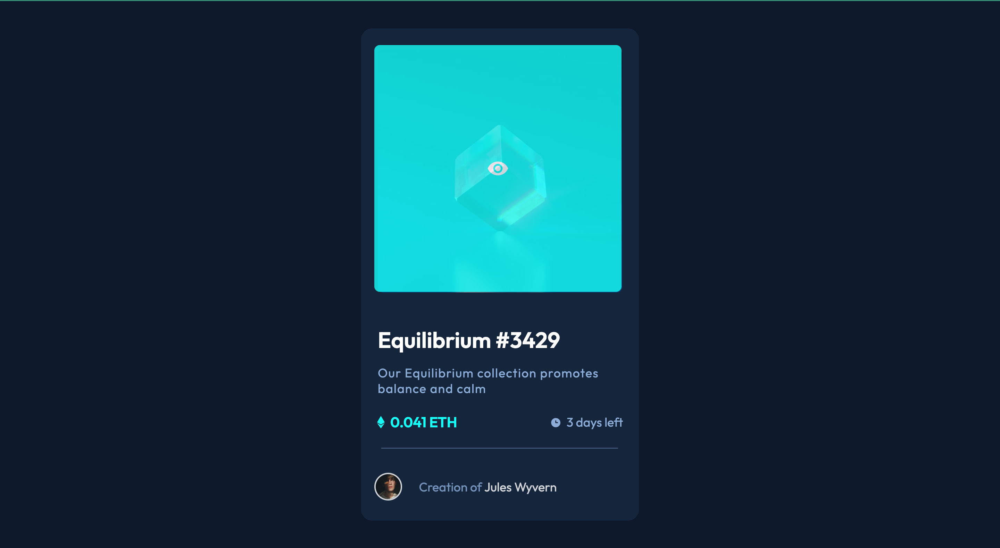

# Frontend Mentor - NFT preview card component solution

This is a solution to the [NFT preview card component challenge on Frontend Mentor](https://www.frontendmentor.io/challenges/nft-preview-card-component-SbdUL_w0U). Frontend Mentor challenges help you improve your coding skills by building realistic projects.

## Table of contents

- [Overview](#overview)
  - [The challenge](#the-challenge)
  - [Screenshot](#screenshot)
  - [Links](#links)
- [My process](#my-process)
  - [Built with](#built-with)
  - [What I learned](#what-i-learned)
  - [Continued development](#continued-development)
  - [Useful resources](#useful-resources)
- [Author](#author)
- [Acknowledgments](#acknowledgments)

## Overview

### The challenge

The challenge is to build out this preview card component and get it looking as close to the design as possible.

### Screenshot



### Links

- Solution URL: [Add solution URL here](https://your-solution-url.com)
- Live Site URL: [Add live site URL here](https://your-live-site-url.com)

## My process

### Built with

- Semantic HTML5 markup
- CSS custom properties
- Flexbox
- CSS Grid

### What I learned

I learned hover on image and header element.Also I learned draw a line after elements.Beside all these,I reinforced knowledge about Flexbox,Position and all CSS elements.

To see how you can add code snippets, see below:

```html
<div class="main_content-price--eth">
  
  <h2 class="eth_price">0.041 ETH</h2>
</div>
```

```css
.main_content-price--eth {
  position: relative;
}

.eth_img {
  position: absolute;
  bottom: 4px;
}

.eth_price {
  margin-left: 1.2rem;
  color: hsl(178, 100%, 50%);
  font-size: 1.3rem;
}


## Author

- Website - [Mehmet Cevat Morçiçek](https://github.com/morcicek)
- Frontend Mentor - [@morcicek](https://www.frontendmentor.io/profile/morcicek)
- Twitter - [@morcicek_m](https://twitter.com/morcicek_m)

```
